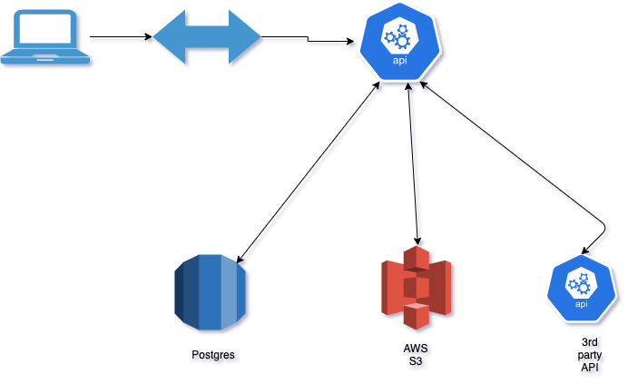
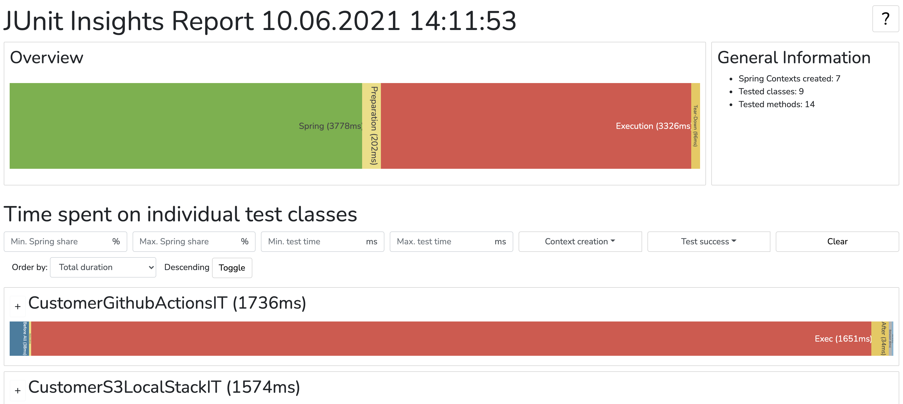

# Spring integration tests

[](https://github.com/shavo007/spring-integ-demo/actions/workflows/push.yml)
[](https://codecov.io/gh/shavo007/spring-integ-demo)



> Integration testing is a healthy part of the [test pyramid](https://martinfowler.com/articles/practical-test-pyramid.html)

- **Improved portability**: Mocking your dependencies with testcontainers allows you to run your tests anywhere Docker is installed. It removes the need for username/password credentials and open ports to the external network, and the overall overhead associated with these resources.
- **Known stateful setup**: Utilizing testcontainers allows you to have the same consistent state before every run of your functional test. This reduces the reliance on a proper test state in your real dependencies. The  **“ephemeral”** nature of docker containers helps. ie. we mean that the container can be stopped and destroyed, then rebuilt and replaced with an absolute minimum set up and configuration.

## Definition of an integration test

 An integration test can be any of the following:

- a test that covers multiple “units”. It tests the interaction between two or more clusters of cohesive classes.
- a test that covers multiple layers. This is actually a specialization of the first case and might cover the interaction between a business service and the persistence layer, for instance.
- a test that covers the whole path through the application. In these tests, we send a request to the application and check that it responds correctly and has changed the database state according to our expectations.

## Test showcases

- [CustomerFullBlownIT](./src/test/java/com/example/integdemo/CustomerFullBlownIT.java)showcase full blown integ test with db (bootstraps entire web container) `mvn test -Dtest=CustomerFullBlownIT`
- [CustomerFullBlownEmbeddedIT](./src/test/java/com/example/integdemo/CustomerFullBlownEmbeddedIT.java) showcase full blown integ test with embedded db (bootstraps spring app context but not starts server) `mvn test -Dtest=CustomerFullBlownEmbeddedIT`
- [CustomerFullBlownTestConIT](./src/test/java/com/example/integdemo/CustomerFullBlownTestConIT.java)showcase full blown integ test with testcontainer db (bootstraps entire web container) `mvn test -Dtest=CustomerFullBlownTestConIT`
- [CustomerControllerIT](./src/test/java/com/example/integdemo/CustomerControllerIT.java) showcase integ test with only web layer (not start http server) `mvn test -Dtest=CustomerControllerIT`
- [CustomerThirdPartyAPIIT](./src/test/java/com/example/integdemo/CustomerThirdPartyAPIIT.java) showcase generic container to test out integration with 3rd party API `mvn test -Dtest=CustomerThirdPartyAPIIT`
- [CustomerS3LocalStackIT](./src/test/java/com/example/integdemo/CustomerS3LocalStackIT.java) AWS s3 example with localstack `mvn test -Dtest=CustomerS3LocalStackIT`
- [CustomerGithubActionsIT](./src/test/java/com/example/integdemo/CustomerGithubActionsIT.java) showcase running as github action with docker containers `mvn test -Dtest=CustomerGithubActionsIT`
- [CustomerRestAssuredIT](./src/test/java/com/example/integdemo/CustomerRestAssuredIT.java) showcase using restAssured `mvn test -Dtest=CustomerRestAssuredIT`
- [CustomerControllerExceptionHandIT](./src/test/java/com/example/integdemo/CustomerControllerExceptionHandIT.java) showcase exception handling `mvn test -Dtest=CustomerControllerExceptionHandIT`

## Mvn failsafe plugin

Run all integration tests

```bash
mvn -V -ff verify
```

## Considerations

- `Do not run unit and integ tests together` (use diff src sets or use maven failsafe plugin)
- Caution when Customizing the Application Context : Each customization of the application context is one more thing that makes it different from the "real" application context that is started up in a production setting. So, in order to make our tests as close to production as we can, we should only customize what's really necessary to get the tests running!
- The benefit of Testcontainers is that the database always starts in a known state, without any contamination between test runs or on developers' local machines.
- If our PostgreSQL container is going to listen to a random port every time, then we should somehow set and change the `spring.datasource.url` configuration property dynamically. Solution is to use Spring `@DynamicPropertySource`

## Start the app

```bash
#can create a docker compose file here instead
docker run --name postgres-demo -e POSTGRES_PASSWORD=root -p 5432:5432 -d postgres:11
docker run -d -p8090:8081 shanelee007/greetings-api:latest
docker run -d -p 4566:4566 -p 4571:4571 localstack/localstack -e "SERVICES=dynamodb,s3"

mvn spring-boot:run
```

```bash
docker exec -it postgres-demo bash
psql -d postgres -U postgres
\l #list databases
\dt #list tables
\dn #list schemas
\s #command history

SELECT * from customer;
```

## Junit insights report



## Performance

BEFORE
```bash
[INFO] ------------------------------------------------------------------------
[INFO] Total time:  01:30 min
[INFO] Finished at: 2021-07-06T21:59:11+10:00
[INFO] ------------------------------------------------------------------------
```

AFTER with parallel execution
```bash
[INFO] ------------------------------------------------------------------------
[INFO] Total time:  01:15 min
[INFO] Finished at: 2021-07-06T22:30:02+10:00
[INFO] ------------------------------------------------------------------------
```

```xml
  <configurationParameters>
           junit.jupiter.execution.parallel.enabled=true
           junit.jupiter.execution.parallel.mode.default=concurrent
           junit.jupiter.execution.parallel.mode.classes.default=concurrent
         </configurationParameters>
```

## Resources

- [test slices](https://docs.spring.io/spring-boot/docs/current/reference/html/test-auto-configuration.html)
- [test insights](https://github.com/adessoAG/junit-insights)
- [dynamically set config](https://www.baeldung.com/spring-dynamicpropertysource)
- [test containers database](https://www.testcontainers.org/modules/databases/)
- [maven failsafe plugin](https://www.baeldung.com/maven-integration-test#failsafe)
- [quirks of testconfiguration](https://www.sivalabs.in/2020/12/quirks-of-spring-testconfiguration/)
- [test containers demo](https://github.com/drjunior90/testcontainers-demo)
